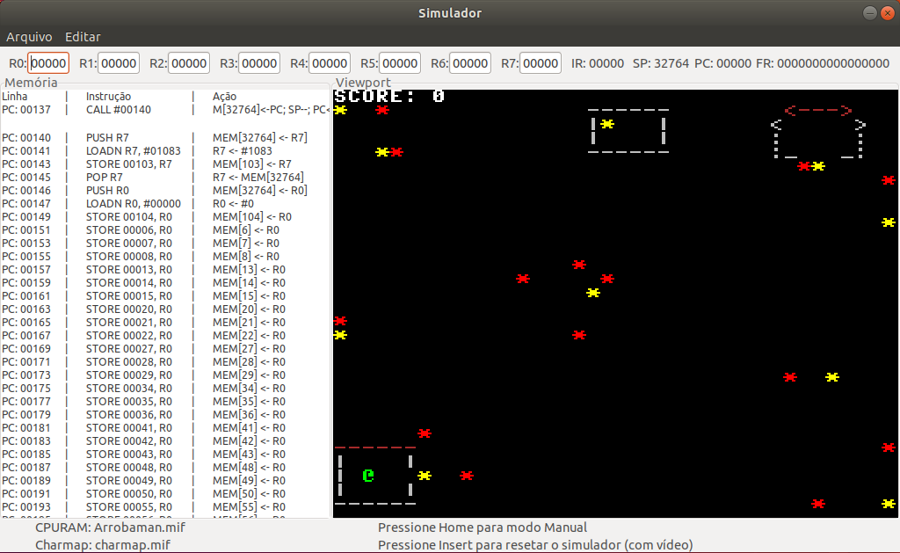

# Atman

OVERVIEW
--------------------------------------------------
The purpose of this project was to implement a retro game in ICMC Assembly for the [Computer Organization and Architecture] course. ICMC Assembly is a simplified assembly implementation for academic purposes. It was made at the Computer Science undergraduate program from University of São Paulo (ICMC - USP).



PROJECT
--------------------------------------------------
This is a simple adventure game but it was made with care because I love retro games.
This was a nice opportunity to learn how to program using Assembly language and basic game concepts like gaming loop, pixel colision.
My inspiration for making this game was Atari 2600 Dragonfire which is game I used to play when I was a kid.
I did some sketches on my notebook and started programming, it was a lot of fun.

HOW TO PLAY
--------------------------------------------------
You have to collect all the jewels in the room without touching any of the enemies and go inside the house.
Some jewels cannot be collected without entering warps which are invisible inside the room, so you have to discover where are these warps.
The jewels are the yellow `*` and the enemies are the red `*` which move vertically and horizontally so be careful.
This game looks easy but it will take you some practice before you beat it.

CONTROLS:
* W: up
* S: down
* A: left
* D: right

HOW TO ASSEMBLE AND RUN
--------------------------------------------------
This guide is for Linux.
To run the assembler and the simulator you have to install the dependencies bellow:

```bash
	1. sudo su
	2. apt install libcanberra-gtk-module libcanberra-gtk3-module
	3. apt-get install libgtk2.0-dev
	4. apt-get install libncurses5-dev
```

Installing the Assembler:
```bash
	1. Extract the Assembler folder.
	2. Using the terminal, go to the Assembler folder (montador_fonte) and compile it through the command `gcc *.c -o assembler`
	3. Copy the assembler executable file to a folder of your preference.
```

Installing the Simulator:
```bash
	1. Extract the simulator folder.
	2. Using the terminal, go to the Simulator folder (simulador_fonte) and compile it through the command `sh compila.sh`
	3. Copy the simulator executable file to a folder of your preference.
```

Assembling and Running the Game:
```bash
	1. ./assembler atman-2019.asm atman-2019.mif
	This is going to generate a .mif file

	2. ./sim atman-2019.mif charmap.mif
	Note: The charmap.mif file is included in this repository, you need to extract it.

	3. After opening the simulator window, press HOME key to start.
```
